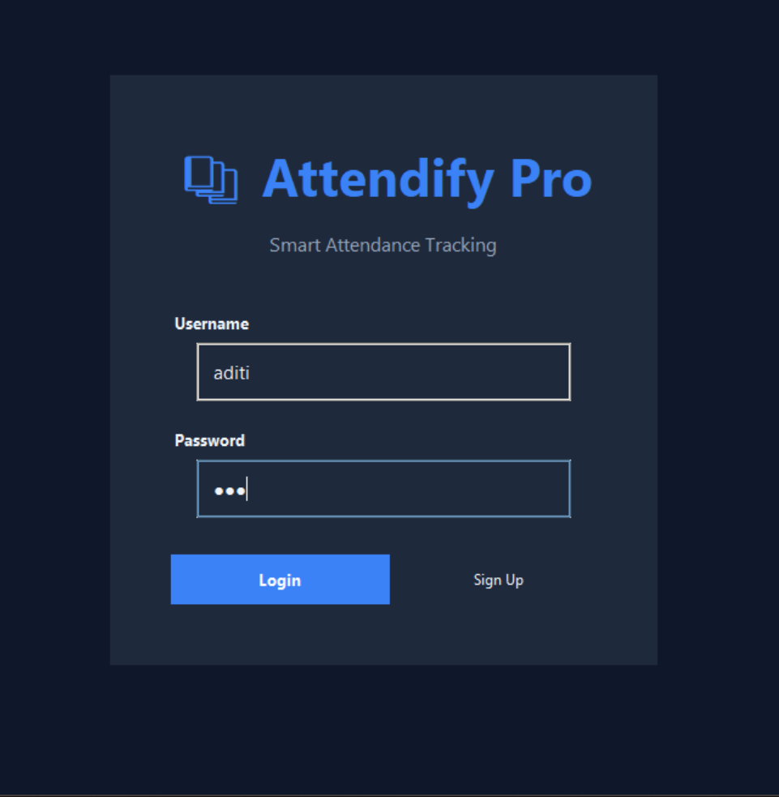
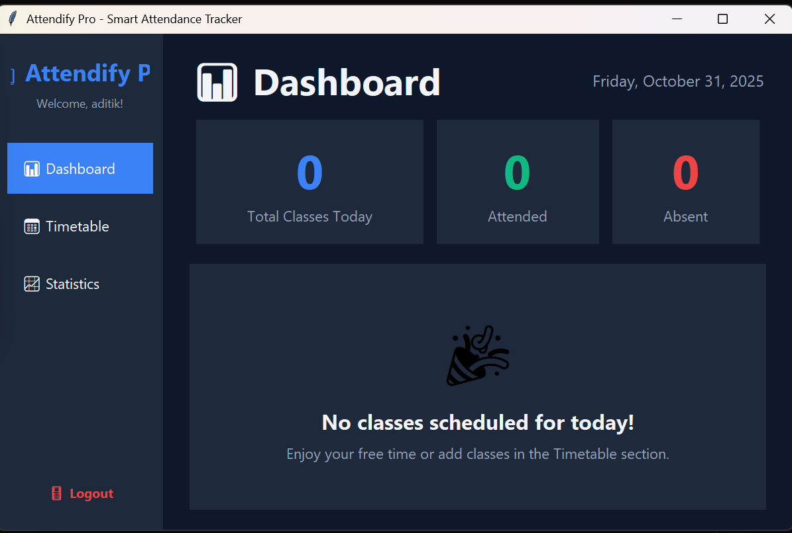
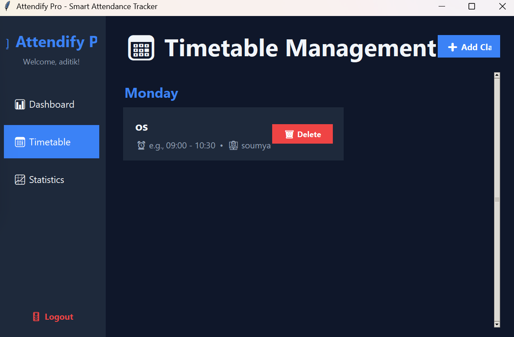
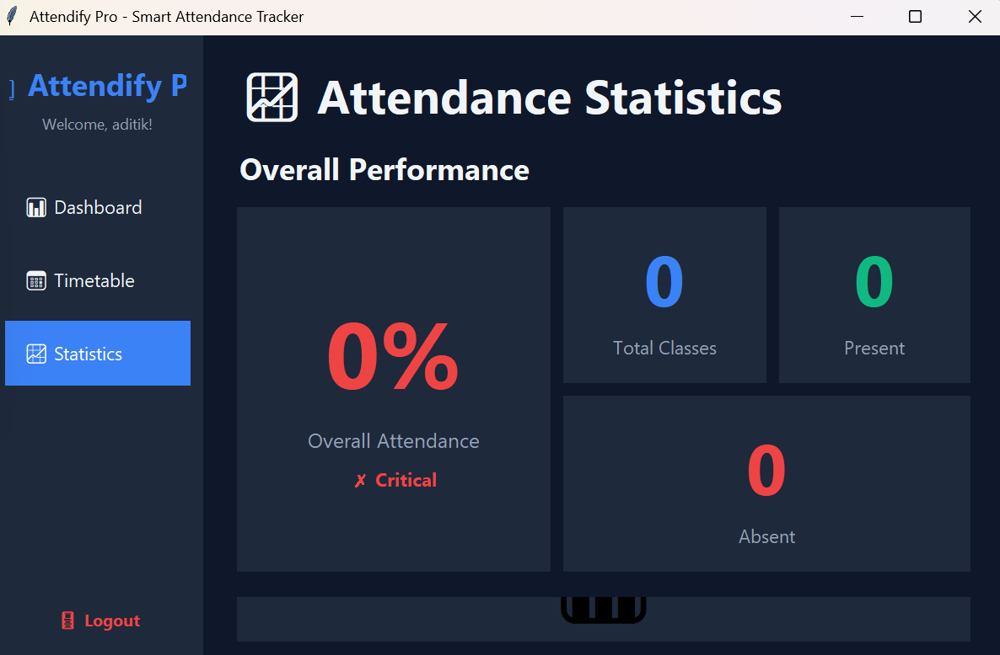

# 📚 Attendify Pro - Smart Attendance Tracker

<div align="center">


**A beautiful, modern desktop application for tracking class attendance with intuitive interface and powerful analytics.**

[Features](#-features) • [Installation](#-installation) • [Usage](#-usage) • [Screenshots](#-screenshots) • [Documentation](#-documentation)

</div>

---

## 🌟 Overview

Attendify Pro is a self-contained, user-friendly desktop application built with Python, designed specifically to help students effortlessly track their class attendance. It provides a clean, intuitive interface to manage schedules, mark daily attendance, and visualize progress towards academic requirements—all without needing an internet connection.

### Why Attendify Pro?

- ✅ **Zero Dependencies**: Uses only Python standard libraries (Tkinter + SQLite)
- ✅ **Complete Privacy**: All data stored locally on your machine
- ✅ **Offline First**: No internet connection required
- ✅ **Beautiful UI**: Modern, clean interface with dark theme
- ✅ **Instant Insights**: Real-time statistics with color-coded alerts
- ✅ **Cross-Platform**: Works on Windows, macOS, and Linux

---

## ✨ Features

### 🔐 Secure User Authentication
- **Private Accounts**: Create personal account with unique username and password
- **SHA-256 Encryption**: Industry-standard password hashing for security
- **Local Storage**: All data stored in encrypted SQLite database

### 📊 Smart Dashboard
- **Today's Schedule**: View all classes scheduled for the current day
- **One-Click Marking**: Mark attendance as Present or Absent instantly
- **Live Statistics**: Real-time daily attendance counts and percentages
- **Quick Overview**: See total, attended, and missed classes at a glance

### 📅 Comprehensive Timetable Management
- **Easy Class Entry**: Add classes with subject, day, time, professor, and room
- **Organized View**: Classes sorted by day of week and time slot
- **Flexible Editing**: Delete classes you no longer attend
- **Detailed Information**: Store professor names and room numbers

### 📈 Insightful Statistics
- **Overall Performance**: View total attendance percentage across all subjects
- **Subject-wise Breakdown**: Individual statistics for each subject
- **Visual Progress Bars**: Color-coded attendance indicators
- **Smart Alerts**: 
  - 🟢 **Green (≥75%)**: Excellent attendance
  - 🟠 **Orange (60-74%)**: Needs improvement
  - 🔴 **Red (<60%)**: Critical - immediate action required

---

## 🚀 Installation

### Prerequisites

- Python 3.6 or higher (check with `python --version` or `python3 --version`)
- No additional dependencies required!

### Quick Start

1. **Clone the repository**
   ```bash
   git clone https://github.com/yashjaiswal2818/Attendify.git
   cd Attendify
   ```

2. **Run the application**
   ```bash
   python main.py
   ```
   
   Or on macOS/Linux:
   ```bash
   python3 main.py
   ```

That's it! The application will launch immediately.

### Alternative: Download ZIP

1. Download the ZIP file from the [releases page](https://github.com/yashjaiswal2818/Attendify/releases)
2. Extract the files
3. Run `python main.py`

---

## 📖 Usage

### First Time Setup

1. **Launch the application**
   ```bash
   python main.py
   ```

2. **Create your account**
   - Click "Sign Up"
   - Enter a username and password (minimum 4 characters)
   - Click "Sign Up" to create your account

3. **Login**
   - Enter your credentials
   - Click "Login"

### Building Your Timetable

1. Navigate to **📅 Timetable** section
2. Click **➕ Add Class**
3. Fill in the details:
   - Subject Name (required)
   - Day of Week (required)
   - Time Slot (required) - e.g., "09:00 - 10:30"
   - Professor Name (optional)
   - Room Number (optional)
4. Click **Save Class**

### Daily Attendance Tracking

1. Open the **📊 Dashboard**
2. View today's scheduled classes
3. For each class:
   - Click **Present ✓** if you attended
   - Click **Absent ✗** if you missed it
4. Watch your daily statistics update in real-time!

### Monitoring Your Progress

1. Go to **📈 Statistics** section
2. View your overall attendance percentage
3. Check subject-wise breakdown
4. Identify subjects that need attention (color-coded alerts)

---

## 📸 Screenshots

### Login Screen


### Dashboard


### Timetable Management


### Statistics


---

## 🗂️ Project Structure

```
Attendify/
│
├── main.py              # Main application entry point
├── database.py          # Database operations and schema
├── auth.py              # Authentication UI and logic
├── dashboard.py         # Dashboard interface
├── timetable.py         # Timetable management UI
├── statistics.py        # Statistics and analytics UI
├── attendify.db         # SQLite database (created on first run)
├── README.md            # This file
├── LICENSE              # MIT License
└── .gitignore           # Git ignore rules
```

---

## 🎨 Color Scheme

The application uses a modern dark theme with carefully selected colors:

| Color | Hex Code | Usage |
|-------|----------|-------|
| Primary Blue | `#3b82f6` | Buttons, highlights, branding |
| Success Green | `#10b981` | Present status, good attendance |
| Warning Orange | `#f59e0b` | Needs improvement (60-74%) |
| Danger Red | `#ef4444` | Absent status, critical attendance |
| Dark Background | `#0f172a` | Main background |
| Card Background | `#1e293b` | Cards and panels |
| Text Primary | `#f1f5f9` | Main text |
| Text Secondary | `#94a3b8` | Secondary text |

---

## 🗄️ Database Schema

### Users Table
```sql
CREATE TABLE users (
    id INTEGER PRIMARY KEY AUTOINCREMENT,
    username TEXT UNIQUE NOT NULL,
    password_hash TEXT NOT NULL,
    created_at TIMESTAMP DEFAULT CURRENT_TIMESTAMP
)
```

### Classes Table
```sql
CREATE TABLE classes (
    id INTEGER PRIMARY KEY AUTOINCREMENT,
    user_id INTEGER NOT NULL,
    subject_name TEXT NOT NULL,
    day_of_week TEXT NOT NULL,
    time_slot TEXT NOT NULL,
    professor TEXT,
    room_number TEXT,
    FOREIGN KEY (user_id) REFERENCES users(id) ON DELETE CASCADE
)
```

### Attendance Table
```sql
CREATE TABLE attendance (
    id INTEGER PRIMARY KEY AUTOINCREMENT,
    class_id INTEGER NOT NULL,
    user_id INTEGER NOT NULL,
    date DATE NOT NULL,
    status TEXT NOT NULL,
    FOREIGN KEY (class_id) REFERENCES classes(id) ON DELETE CASCADE,
    FOREIGN KEY (user_id) REFERENCES users(id) ON DELETE CASCADE,
    UNIQUE(class_id, date)
)
```

---

## 🔧 Technical Details

### Built With
- **Python 3.6+**: Core programming language
- **Tkinter**: GUI framework (included with Python)
- **SQLite3**: Database (included with Python)
- **hashlib**: Password encryption (included with Python)

### Architecture
- **MVC Pattern**: Separation of concerns
- **Modular Design**: Each feature in separate file
- **Database Layer**: Abstracted database operations
- **UI Components**: Reusable widget patterns

### Security Features
- ✅ SHA-256 password hashing
- ✅ No plain text password storage
- ✅ Local-only data storage
- ✅ User data isolation
- ✅ Secure database queries (parameterized)

---

## 🤝 Contributing

Contributions are welcome! Here's how you can help:

1. **Fork the repository**
2. **Create a feature branch**
   ```bash
   git checkout -b feature/AmazingFeature
   ```
3. **Commit your changes**
   ```bash
   git commit -m 'Add some AmazingFeature'
   ```
4. **Push to the branch**
   ```bash
   git push origin feature/AmazingFeature
   ```
5. **Open a Pull Request**

### Ideas for Contributions
- 🎨 Additional themes (light mode, custom colors)
- 📊 Export attendance reports (CSV, PDF)
- 📧 Email notifications for low attendance
- 📱 Responsive design improvements
- 🌍 Multi-language support
- 📅 Calendar view for attendance
- 🔔 Desktop notifications
- 📈 Advanced analytics and charts

---

## 🐛 Known Issues

- None currently! If you find a bug, please open an issue on GitHub

---

## 📋 Roadmap

- [ ] Export attendance data to CSV/Excel
- [ ] Print attendance reports
- [ ] Backup and restore functionality
- [ ] Multiple semester support
- [ ] Attendance goals and reminders
- [ ] Light theme option
- [ ] Custom color themes
- [ ] Multi-user support with admin features

---

## 📝 License

This project is licensed under the MIT License - see the [LICENSE](LICENSE) file for details.

---

## 👨‍💻 Author

**Shraddha Jaiswal**
- GitHub: [@yashjaiswal2818](https://github.com/yashjaiswal2818)
- Email: your.email@example.com

---

## 🙏 Acknowledgments

- Built with Python's amazing standard library
- Inspired by the need for simple, offline attendance tracking
- Thanks to all students who need a better way to track attendance
- Emoji icons from Unicode standard

---

## 📞 Support

If you have any questions or need help:

- 📫 Open an issue: https://github.com/yashjaiswal2818/Attendify/issues
- 💬 Start a discussion: https://github.com/yashjaiswal2818/Attendify/discussions
- 📧 Email: your.email@example.com

---

## ⭐ Show Your Support

If you find this project helpful, please consider giving it a ⭐ on GitHub!

---

<div align="center">

**Made with ❤️ for students everywhere**

[⬆ Back to Top](#-attendify-pro---smart-attendance-tracker)

</div>
# Python-Project
# Attendify
# Attendify
